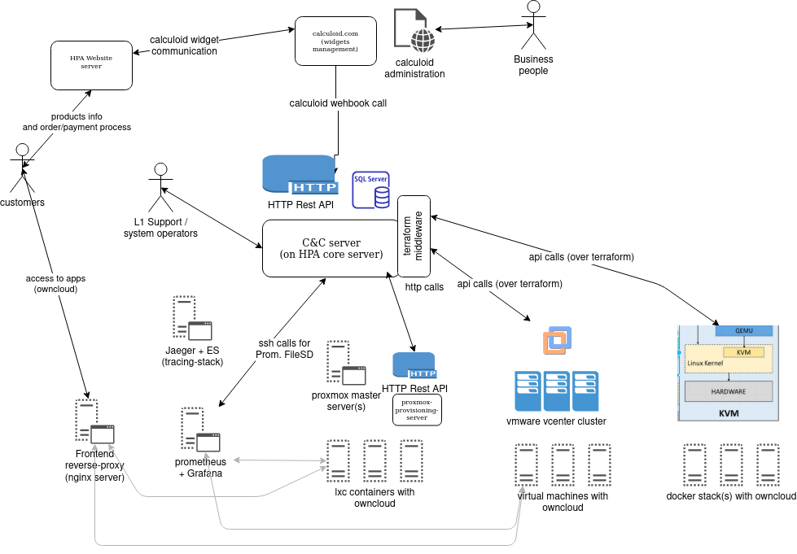

# H Platform Automation - Documentation

## basic description and schema

### v2
- added proxmox-provisioning-server for lxc containers support
- added dockerized owncloud-stack (systemd service with docker-compose, VM based on CoreOS)
- added website (wordpress) in docker-compose mode (on virtual machine)
- added tracing (jaeger) in docker-compose mode (on virtual machine)
- monitoring based on prometheus and grafana
  - frontend proxy based on nginx
  - tracing support
- supported "apps": owncloud
- jenkins server deprecated

high level diagram

### v1
- first opensourced version
- with customer modification (calculoid)
- supported "apps": owncloud
- supported infra (for apps):
  - lxc containers on proxmox
  - virtual machines on vmware vcenter 
- CI/CD based on jenkins server
- monitoring based on prometheus and grafana

- without dockerized owncloudstack
- without dockerized website (wordpress)
- without tracing

high level diagram

## technical overview
[technical overview](docs/technical-docs.md)

[development status](docs/development-status.md)

[logging](docs/logging.md)

## component overview
[monitoring](docs/monitoring-cs.md) (in czech)

[c&c server](docs/c-and-c-server.md) (in czech)

[calculoid webook](docs/calculoid-webhook-url.md)

## repositories

### core
https://github.com/czhujer/h-platform-automation-core/blob/master/README.md

### cm
https://github.com/czhujer/h-platform-automation-cm/blob/master/README.md

### website
https://github.com/czhujer/h-platform-automation-website/blob/master/README.md

### monitoring
https://github.com/czhujer/h-platform-automation-monitoring/blob/master/README.md

### tracing
https://github.com/czhujer/h-platform-automation-tracing/blob/master/README.md

### C&C server (unde development)
https://github.com/czhujer/h-platform-automation-cc-server/blob/master/README.md

### message broker (testing purposes)
https://github.com/czhujer/h-platform-automation-message-broker/blob/master/README.md
